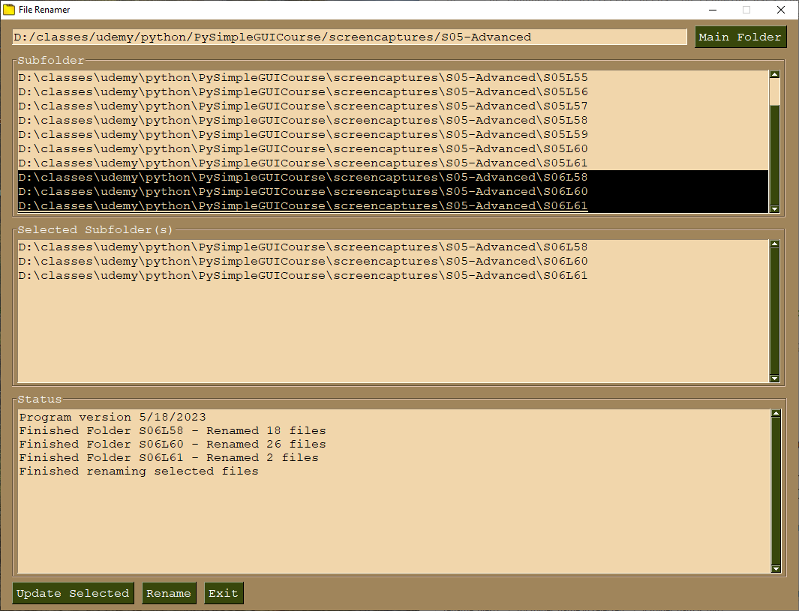

# Multifolder Rename #

Rename files inside selected folders.

## Description ##

This script allows the user to select multiple folders and then renames
all the files inside these folders. Both the PySimpleGUI FolderBrowse()
and popup_get_folder() only allow a single folder to be selected so this
script is an example of how to select multiple folders.

The renaming is specific to my use but is done in rename_files() and can
be changed for different needs. My renaming uses the parent folder name as
a base then adds a number as a suffix which is incremented for each file in
the folder.

## Screenshot ##

## Credits ##

* Tab folder icon by ArtWorkLeaf from https://thenounproject.com/icon/tab-2768111/ to which a gradient background was added.

## Changelog ##
### 5/25/2023 ###
* Add readme and screenshot
* Add GNU GPLv3 license file

### 5/24/2023 ###
* Initial release on Github.
